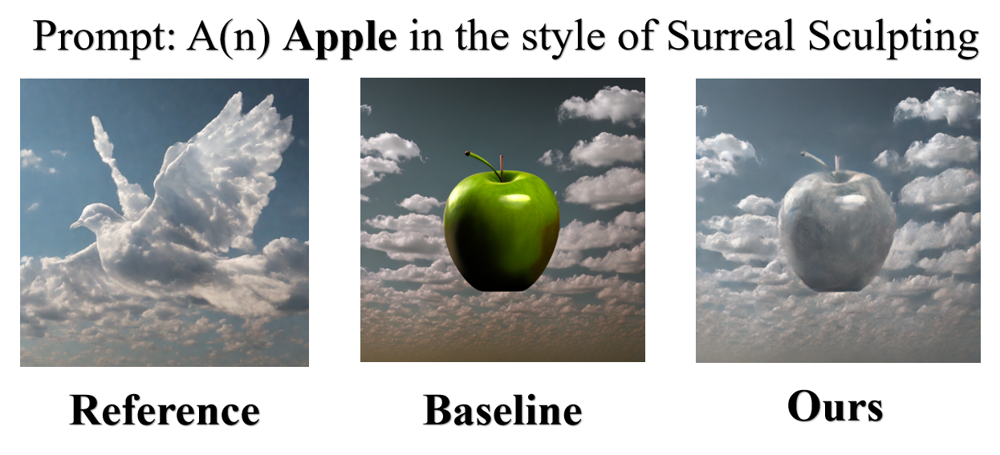

# Jittor 风格迁移图片生成赛题



## 简介

本项目包含了第四届计图挑战赛风格迁移图片生成赛题的代码实现。本项目采用了多种方法对图片处理，取得了符合风格的效果。

## 安装 

本项目在3090上运行，训练一个风格从4分钟到1小时不等。

#### 运行环境

- ubuntu 20.04.6 LTS
- python == 3.9
- jittor == 1.3.10
- CUDA == 12.2

#### 安装依赖

安装官方baseline指导安装所有库，然后用libs中的文件替换你环境中相应的文件。

#### 预训练模型

我没有云盘空间，但是我传给了比赛官方，你可以联系他们以获得我提交的权重，将下载的weights文件夹放置在项目根目录下即可。

## 数据预处理

生成推理时固定的随机种子起始latents

```
bash scripts/gen.sh
```

## 训练

```
python train.py
```

## 推理

```
python test.py
```

## 致谢
```
@inproceedings{huang2017arbitrary,
  title={Arbitrary style transfer in real-time with adaptive instance normalization},
  author={Huang, Xun and Belongie, Serge},
  booktitle={Proceedings of the IEEE International Conference on Computer Vision},
  pages={1501--1510},
  year={2017}
}

@inproceedings{chung2024style,
  title={Style injection in diffusion: A training-free approach for adapting large-scale diffusion models for style transfer},
  author={Chung, Jiwoo and Hyun, Sangeek and Heo, Jae-Pil},
  booktitle={Proceedings of the IEEE/CVF Conference on Computer Vision and Pattern Recognition (CVPR)},
  pages={8795--8805},
  year={2024}
}

@article{liu2024parameter,
  title={Parameter-efficient orthogonal finetuning via butterfly factorization},
  author={Liu, Weiyang and Qiu, Zeju and Feng, Yao and Xiu, Yuliang and Xue, Yuxuan and Yu, Longhui and Feng, Haiwen and Liu, Zhen and Heo, Juyeon and Peng, Songyou and Wen, Yandong and Black, Michael J. and Weller, Adrian and Schölkopf, Bernhard},
  journal={Proceedings of the IEEE/CVF Conference on Computer Vision and Pattern Recognition (CVPR)},
  year={2024},
  url={https://boft.wyliu.com}
}

@article{liu2024dora,
  title={DoRA: Weight-Decomposed Low-Rank Adaptation},
  author={Liu, Shih-Yang and Wang, Chien-Yi and Yin, Hongxu and Molchanov, Pavlo and Wang, Yu-Chiang Frank and Cheng, Kwang-Ting and Chen, Min-Hung},
  journal={Proceedings of the IEEE/CVF Conference on Computer Vision and Pattern Recognition (CVPR)},
  year={2024}
}

@misc{JDiffusion2024,
  author = {Jittor Team},
  title = {JDiffusion: Jittor-based Diffusion Models},
  year = {2024},
  howpublished = {\url{https://github.com/JittorRepos/JDiffusion}},
  note = {Accessed: 2024-10-18}
}

@misc{PEFT2024,
  author = {Hugging Face Team},
  title = {PEFT: Parameter-Efficient Fine-Tuning},
  year = {2024},
  howpublished = {\url{https://github.com/huggingface/peft}},
  note = {Accessed: 2024-10-18}
}
```
